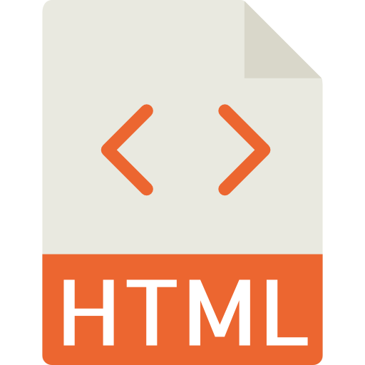
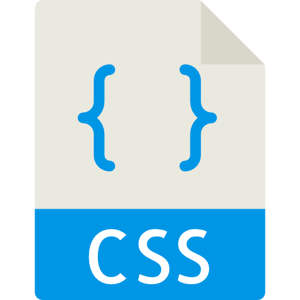
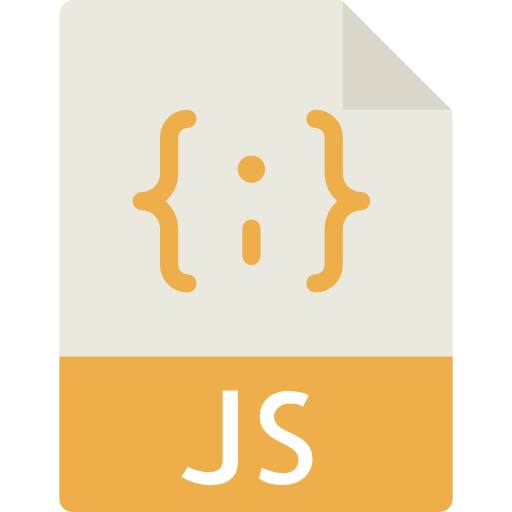
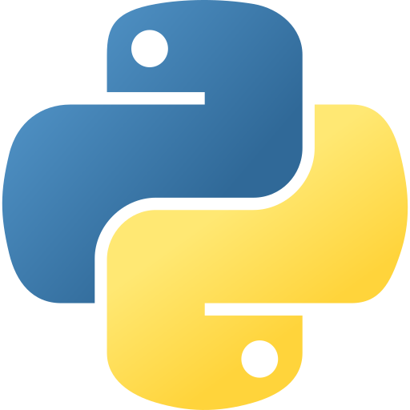
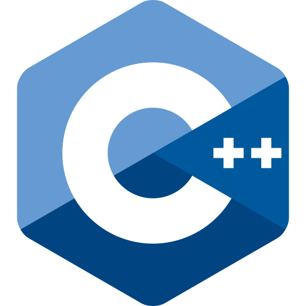

<h1>Hey, how's it going?</h1>

My name is <a href="www.linkedin.com/in/brandon-whitman-orlin">Brandon</a> and I'm a Full Stack Developer and computer enthusiast with a Computer Science degree from Penn State Abington.

I am currently employed at <a href="https://quadconsultation.com/">Quad Consultation</a> where I work as a freelance front-end developer for small and medium sized businesses.

<h2>Top Skills</h2>

  
  
  
  

<h2>Other Skills</h2>

  
  
  
  
  

 

To learn more or to contact me, find me at my website <a href="https://woahcodes.com/">here</a>.
